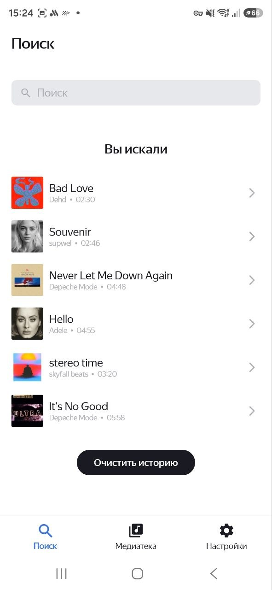
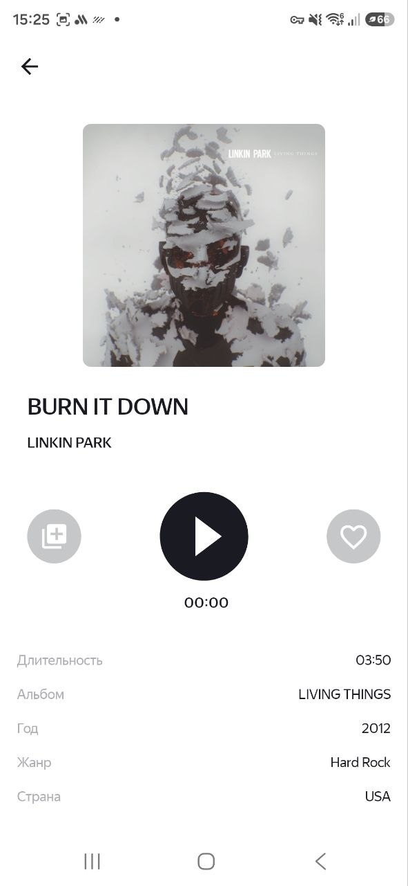
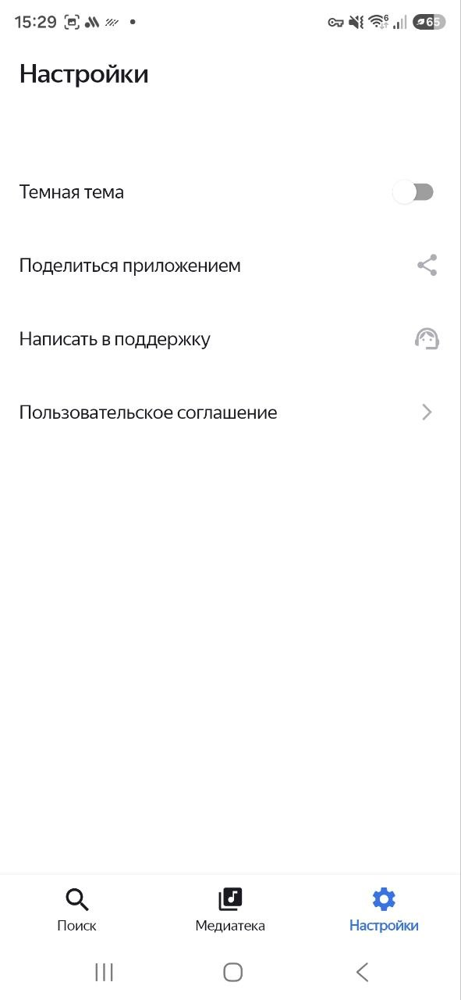

# 🎵 Playlist Maker

**Playlist Maker** is an Android application for searching music, playing tracks, and managing a personal music library.

## 🛠 Tech Stack

* **Kotlin**
* **XML + View Binding**
* **MVVM**
* **Koin** — dependency injection
* **Room** — local database
* **Retrofit + Gson** — network requests and JSON parsing
* **Kotlin Coroutines** — asynchronous operations
* **Glide** — image loading
* **Navigation Component**
* **SharedPreferences** — local storage
* Min Android API: **29**
* Compile SDK: **36**
* Java / JVM: **11**

## ✨ Features

* 🔎 **Music Search** — search tracks using the iTunes Search API, debounce queries, and store search history
* 🎧 **Audio Player** — play and pause tracks, display track information and playback state
* ❤️ **Favorites** — add and remove tracks from favorites, stored locally with Room
* 📂 **Playlists** — create, edit and delete playlists, manage tracks and playlist covers
* 📚 **Media Library** — browse favorite tracks and playlists
* ⚙️ **Settings** — switch between light and dark themes and manage application settings
## 📱 Screenshots

| 🔎 Search & History                                                                   | 🎧 Audio Player                                                    |
|---------------------------------------------------------------------------------------|--------------------------------------------------------------------|
|  |  |

| 🎵 Playlist                                                          | 📚 Playlists                                                          |
|----------------------------------------------------------------------|-----------------------------------------------------------------------|
|  |  |

| ⚙️ Settings                                                          |
|----------------------------------------------------------------------|
|  |

## 🏗 Architecture

The project uses a layered architecture based on **MVVM**:

```text
UI
 ↓
ViewModel
 ↓
Interactor
 ↓
Repository
 ↓
Data source
```

The project contains a single Gradle module:

```text
app
```

Main layers:

* `ui` — screens, ViewModels, UI states and adapters
* `domain` — business logic, interfaces and domain models
* `data` — network, database, storage and repository implementations
* `di` — Koin dependency injection modules
* `utils` — shared utilities

## 🎨 UI

The UI is built with **XML layouts** and **View Binding**.

The project uses:

* Fragments
* RecyclerView
* ViewPager2
* Bottom Sheets
* Snackbars
* Custom views
* Light and dark themes

## 🚀 Build

### Requirements

* Android Studio
* JDK 11
* Android SDK 36
* Android 10 / API 29+

### Build debug APK

Linux / macOS:

```bash
./gradlew assembleDebug
```

Windows:

```bat
gradlew.bat assembleDebug
```

## 👩‍💻 Author

**valtherys**

